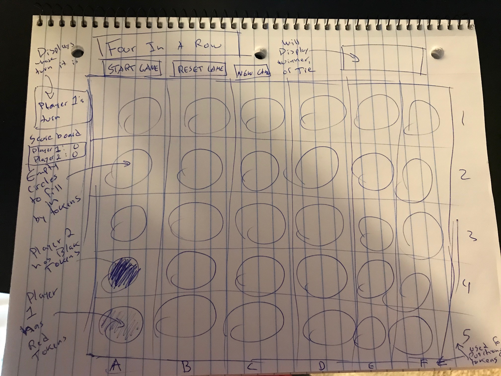

# Game Project - Four In a Row

## Game Description
Four In a Row is a game that involves 2 users, 2 human players or 1 human player and a computer, where each player must try to get 4 tokens in a row horizontally, vertically, or diagonally to win. If neither player is able to get four tokens in a row, it is considered a draw, assuming all of the circles in the bored are filled.

## User Story
1. The game loads and you have two game modes to choose from, computer mode or multiplayer mode.
2. Player 1 , which is automatically assigned the red tokens, will make the first move to place a red token inside a circle on the boardgame.
3. Red token is placed inside a specified circle on the boardgame and the circle will be disabled afterwards, meaning no other token can be placed inside that circle.
4.  Turn switches to player 2 or the computer.
5. Player 2/computer is automatically assiged the yellow token and will place it in a circle on the boardgame that does not already consist of a token.
6. Player 2/computer places a yellow token in a circle and the circle will be disbaled afterwards.
7. Players will keep alternating turns until a player gets 4 in a row or a tie.
8. Click new game button to empty the boardgame and play again while keeping the current scorecard.
9. Click the reset button to empty the boardgame and reset the scoreboard but keeps the current player mode.

## Wireframes

## Technologies Used
- HTML
- CSS
- Vanilla JS

## MVP
- Get the boardgame structured correctly so it will be able to handle the display of the tokens.
- Ensure the tokens fall into the right circle that is clicked.
- Alternate turns between players and maintain whose turn it is 
- Calculate the winner or tie by designing the logic

## Stretch Plan
- Add an option to choose between either multiplayer or computer - This stretch plan has been met
